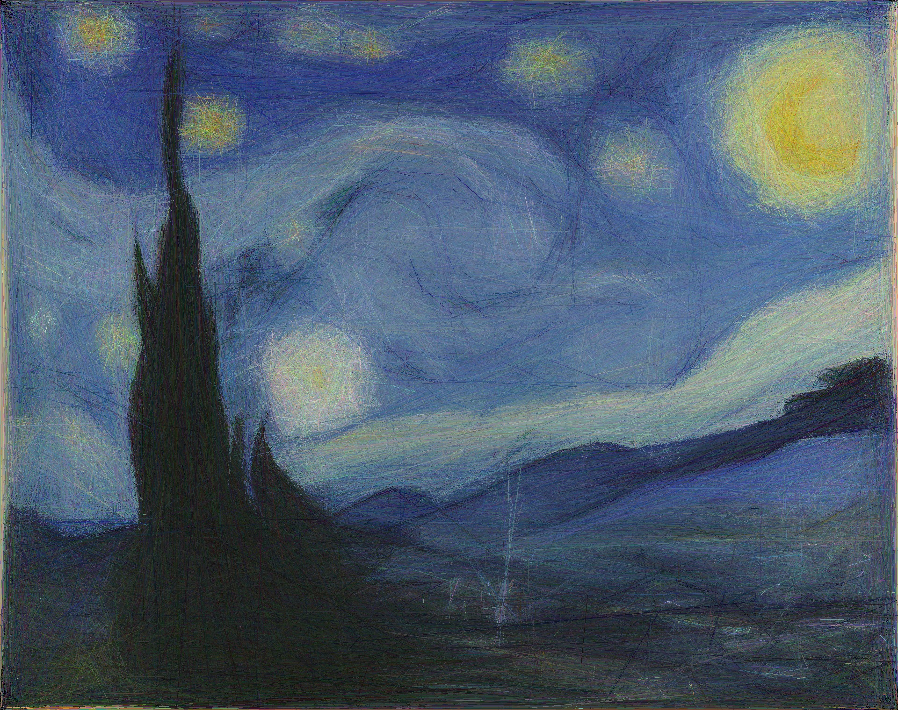
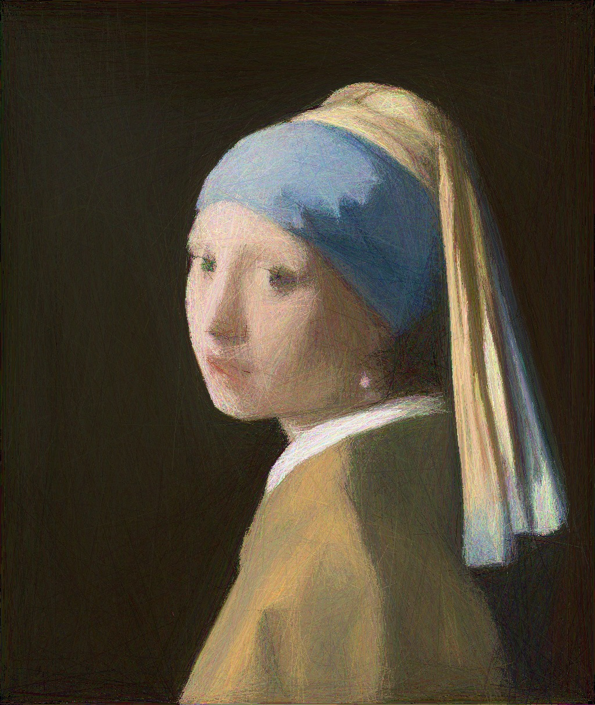

# linez-julia
A Julia port of the original [linez](https://github.com/Patryk27/linez) project that approximates images using lines. Not as fast as the Rust version but I enjoyed watching the image be generated nonetheless.

<p align="center">
  
</p>

<p align="center">
  
</p>

## Usage

```shell
$ git clone https://github.com/ANotFox/linez-julia.git
$ cd linez-julia
$ julia --project=. lines.jl -i test.jpg -n 4096 -d 5 -o output.jpg
# (press escape to save the image and close the window)
```
## Algorithm

1. Load image provided by user (aka the target image - _target_).
2. Create a black image (aka the approximated image - _approx_).
3. Sample a line: randomise starting point, ending point, and colour.
4. Check if drawing this line on the approximated image would reduce _the distance_ between the approximated image and the target image.
5. If so, draw the line; otherwise don't draw it.
6. Go to 3.

## Licence

MIT Licence!
